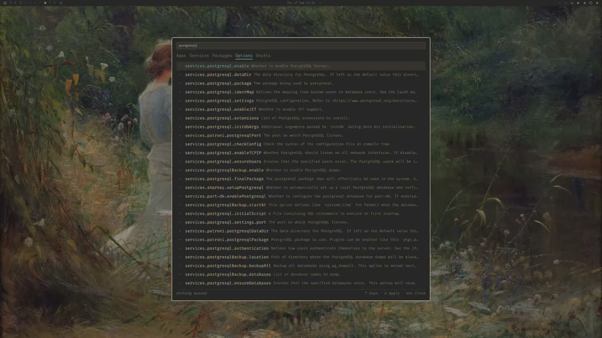
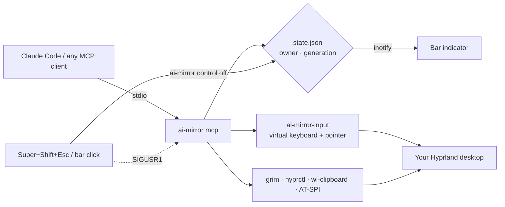

# ai-mirror

**Let an AI agent use your actual desktop — and stop it with one keypress.**

ai-mirror is a small MCP server and Omarchy bar plugin for [Nixarchy](https://github.com/olafkfreund/nixarchy)
(Omarchy on NixOS, Hyprland). It gives Claude Code, Codex, Gemini CLI, opencode or any other
local MCP client eyes and hands on your real session: screenshots of any monitor, a full
keyboard and mouse, window management, the clipboard, and the accessibility tree of your apps.
While it is in control, a red mark sits in your top bar. Click it, or press **Super + Shift + Esc**,
and control is gone — including any key the agent was holding down.

<p>
  <br>
  <sub>Agent control on — the mark turns red and stays there, next to the tray.</sub><br>
  <br>
  <sub>Off — a dim mark. Click it to hand control to your agent, click again to take it back.</sub>
</p>

## See it work

[](https://github.com/olafkfreund/ai-mirror/releases/download/demo-2026-09-18/nixarchy-desktop-showcase.mp4)

<sub>**[▶ Watch the five-minute recording](https://github.com/olafkfreund/ai-mirror/releases/download/demo-2026-09-18/nixarchy-desktop-showcase.mp4)** — an agent takes control, hands it back
on camera, then drives the desktop through the plugins' own keybindings: nixpkgs search, GitHub
Actions, the herdr session menu, nixi, and a full re-theme. The narration is
[nixarchy-voice](https://github.com/olafkfreund/nixarchy-voice) speaking through its own
text-to-speech — the system describing itself, not a voiceover.</sub>

---

## Why

Coding agents are good at the terminal and bad at everything else. The moment a task touches
a browser session you are already logged into, a GUI installer, a settings dialog, an Electron
app, or "just click through this form", the agent stops and hands the work back to you.

Browser automation tools (Playwright, CDP) only see a fresh, empty browser. Sandboxed virtual
desktops keep the agent away from the apps and sessions you actually need it to use. What is
missing is the simple, honest version: **the agent uses the same desktop you do, in the open,
under a switch you control.**

ai-mirror is that, with three rules:

1. **Visible.** Control is either on or off, and when it is on the bar shows it.
2. **Instantly revocable.** One keypress or click wins over anything the agent is doing, mid-action.
3. **Cheap to observe.** Agents read windows and accessibility trees first and only take
   screenshots when pixels matter — scaled, cropped, and mapped back to exact coordinates for them.

> **There is no sandbox.** While control is on, the agent can do anything you can do with a
> keyboard and mouse. Turn it on for a task, watch it, turn it off.

## What an agent can do

| | Tools |
|---|---|
| **See** | `screenshot` any monitor, all monitors or a zoomed region · `windows` (titles, classes, geometry) · `status` |
| **Act** | `input`: move, click (1–3×), drag along a path, scroll, type any Unicode, key combos, hold keys or buttons, shift-click / ctrl-drag via `modifiers` |
| **Manage** | `window`: focus, close, float, center, fullscreen / maximize, move to workspace, resize · `launch` apps · `clipboard` read/write |
| **Understand** | `a11y_tree` / `a11y_find` list buttons, fields and links by role and name · `a11y_act` clicks, focuses or fills them — no pixel guessing |
| **Switch** | `control` on/off — the agent can ask for control; you can always take it away |

Example requests:

- *"Take control, open my Grafana tab in Firefox and tell me why the p620 CPU graph spiked this morning."*
- *"In the Bitwarden desktop app, find the entry for the NAS and copy the username to the clipboard."*
- *"Walk through the printer setup dialog with the defaults, then give control back."*
- *"Arrange Slack on workspace 3, the terminal full-screen on DP-1, and Firefox maximised on DP-2."*

## How it works



- **One switch, one number.** `$XDG_RUNTIME_DIR/ai-mirror/state.json` records whether the agent
  owns input and a `generation` that increases on every change. Screenshots carry the generation
  they were taken under; input from an older one is refused. The file lives in the runtime
  directory, so control is always off after you log in.
- **Checked before every event.** A batch of clicks and keys is re-checked against the switch
  before each individual key or button event, so a stop lands in the middle of a batch, not after it.
- **Releasing held keys is the hard part.** Only the process that owns a virtual keyboard can
  release its keys. The kill switch therefore flips the state *and* signals every running MCP
  server; each closes its input helper, which releases every key and button on the way out.
- **Native input.** A 440-line C helper speaks Wayland's virtual-keyboard and virtual-pointer
  protocols directly, types any Unicode character regardless of your keyboard layout, and keeps
  one device alive so modifier state stays consistent.
- **Coordinates just work.** Agents click on pixels of a scaled or cropped screenshot; ai-mirror maps
  them to global layout pixels across mixed monitor layouts (verified on a gapped three-monitor setup).
- **No strings into the compositor.** Window commands are built only from validated addresses,
  numbers and enums; `launch` uses an argument list, never a shell.

## Install

ai-mirror is a flake with a Home Manager module that plugs into Nixarchy's plugin system.

```nix
# your system flake
inputs.ai-mirror.url = "github:olafkfreund/ai-mirror";

# home-manager.users.<you>, alongside inputs.nixarchy.homeManagerModules.nixarchy
imports = [ inputs.ai-mirror.homeManagerModules.default ];
programs.ai-mirror = {
  enable = true;
  # killSwitch = "SUPER + SHIFT + ESCAPE";
  # a11y.enable = true;   # GTK/Qt accessibility so a11y_* tools see your apps
};
```

The module installs the `ai-mirror` command, registers the bar plugin through
`programs.nixarchy.plugins` (validated at build time), writes the kill-switch binding and
enables toolkit accessibility. After rebuilding, once:

```sh
# 1. load the kill switch: add this line to ~/.config/hypr/bindings.lua
pcall(require, "hypr.ai-mirror-binds")

# 2. show the indicator (Nixarchy installs plugins but leaves enabling to you)
omarchy plugin enable olafkfreund.ai-mirror --section right

# 3. connect your agent
claude mcp add ai-mirror -- ai-mirror mcp
```

Log out and back in once so apps pick up the accessibility settings. Other MCP clients use a
stdio server with command `ai-mirror` and args `["mcp"]`.

Try it without installing anything:

```sh
nix run github:olafkfreund/ai-mirror -- status
```

## Using it yourself

Everything the agent does is also a CLI command that prints JSON:

```sh
ai-mirror control agent                          # same as clicking the dim icon
ai-mirror screenshot --output all --max-size 1600
ai-mirror windows
ai-mirror a11y-find --role "push button" --name Save
ai-mirror control off                            # same as Super+Shift+Esc
```

Full reference — every tool, action, key name, the coordinate model and per-toolkit
accessibility notes (Firefox, Chromium/Electron): **[docs/usage.md](docs/usage.md)**.

## Voice

[nixarchy-voice](https://github.com/olafkfreund/nixarchy-voice) (Oma) uses ai-mirror
automatically when both are installed: say *"click the Save button in that dialog"* and
her Claude brain takes control, acts, and hands it back. Her deny/confirm policy
checks every call first, and the kill switch works the same way. The other
direction works too: `claude mcp add omarchy -- omarchy-voice mcp` gives a ai-mirror
agent Oma's Omarchy and Hyprland tools.

## Safety, plainly

- ai-mirror does not decide what an agent should do. It makes control **visible**, **switchable**
  and **auditable in the moment** — that is all.
- Observation tools work while control is off, so an agent can look but not touch until it is on.
  Anything that types, clicks, launches, changes windows or writes the clipboard needs control.
- When an agent turns control on and its MCP server exits, that grant is revoked automatically.
  Control you granted yourself stays until you turn it off.
- Treat agent control like screen sharing with someone who has your keyboard: don't leave it on
  while you are away, and be careful with password managers and banking tabs.

## Develop

```sh
nix develop
python3 -m unittest discover -s tests          # 16 regressions, no desktop needed
nix flake check                                # unit tests + plugin validation
AI_MIRROR_HELPER=$(nix build .#ai-mirror-input --print-out-paths)/bin/ai-mirror-input \
  python3 tests/smoke.py                       # live: opens a terminal, moves the mouse, types
```

Stdlib Python (PyGObject only for accessibility), one small C helper, QML for the bar.
Contributor and agent notes, including the invariants that keep the switch trustworthy:
[AGENTS.md](AGENTS.md).

## History

ai-mirror started from itchyfeetleech's MIT-licensed project that gave agents an isolated,
nested Omarchy desktop on Arch. This NixOS-only rewrite takes the opposite approach — the agent
works in your real session under a visible switch — and keeps the original's input helper,
frame mapping and handover discipline.

[MIT license](LICENSE) · [Notice](NOTICE)
